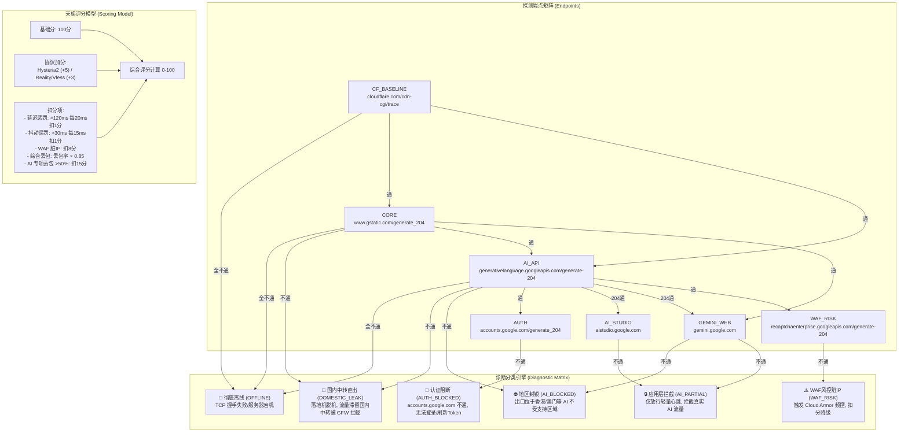

# 🧠 Antigravity Node Benchmark 项目知识图谱与开发全景档案

> **文档版本**: `v1.0.0 (Based on Tool V5.0 Universal)`  
> **建立时间**: `2026-08-28`  
> **维护目标**: 为后续迭代开发、AI 协作续写与架构优化提供无损上下文记忆与底层技术图谱。

---

## 📌 1. 项目定位与核心哲学 (Philosophy & Objectives)

### 1.1 业务背景
Google Antigravity IDE / Gemini Code Assist / Google AI Studio 在国内使用时对网络链路有极严苛的要求：
1. **真实海外出口**：严禁流量滞留国内入口（中转直出/假海外），严禁落地机脱机。
2. **AI 地理围栏合规**：Google 官方对香港（HK）、澳门（MO）等出口实施了 AI 区域封锁。
3. **认证链路完整**：后台依赖 `accounts.google.com` 周期性静默刷新 OAuth Token，若该端点不通会导致会话意外中断。
4. **应用层深度放行**：部分中间件仅放行轻量 204 心跳，但阻断 `aistudio.google.com` / `gemini.google.com` 的应用层流量。
5. **SSE 长流式输出零丢包**：长代码生成为 Server-Sent Events (SSE) 持续流式传输，对丢包与网络抖动极度敏感。
6. **IP 洁净度 (WAF/Cloud Armor)**：避免使用被 Google 标记为机房滥用/脏 IP 的节点，防止被触发验证码或限流。

### 1.2 核心设计准则
- **Zero-Auth (零凭证/零风险)**：严禁在探测过程中引入任何 API Key、OAuth Token 或账号凭证，100% 纯网络层探针。
- **Zero-Dependencies (零第三方依赖)**：全功能基于 Python 3.8+ 标准库（`urllib`, `concurrent.futures`, `json`, `re`），开箱即用。
- **Non-intrusive (非侵入式探测)**：通过 Controller API 或单代理端口探测，绝不影响用户当前前台活动代理。

---

## 🗺️ 2. 8 维全息诊断矩阵知识图谱 (Diagnostic Knowledge Graph)



### 2.1 诊断端点与技术考量

| 端点 Key | 目标 URL | 核心诊断目的 |
| :--- | :--- | :--- |
| `CF_BASELINE` | `https://cloudflare.com/cdn-cgi/trace` | 验证底层 TCP/TLS 国际出海基础连通性 |
| `CORE` | `https://www.gstatic.com/generate_204` | 验证 Google 全球边缘 Anycast 连通性 |
| `AI_API` | `https://generativelanguage.googleapis.com/generate-204` | 验证 Google AI API 网关可达性 |
| `GEMINI_WEB` | `https://gemini.google.com` | 验证 Gemini Web 门户与交互界面出口合规性 |
| `AUTH` | `https://accounts.google.com/generate_204` | 验证 OAuth 认证与 Token 刷新端点可达性 |
| `AI_STUDIO` | `https://aistudio.google.com` | 验证 Google AI Studio 真实应用层流量放行情况 |
| `WAF_RISK` | `https://recaptchaenterprise.googleapis.com/generate-204` | 验证 Google Cloud Armor / 企业 WAF 洁净度 |

---

## 📈 3. 版本迭代演进历程 (Version Evolution)

| 版本 | 核心改动 | 解决的关键痛点 |
| :--- | :--- | :--- |
| **V1.0 ~ V3.0** | 基础版开发 | 跑通 Clash External Controller REST API，实现单端点延时测算 |
| **V3.5** | 多端点交叉矩阵 | 引入 Cloudflare + Google Core 双基准，**首次解决“假海外/国内直出”漏检问题**；修复 URL 编码中斜杠问题（`safe=''`）；修复地区正则误杀 `CN2` 问题 |
| **V4.0 Ultimate** | IP 洁净度 + 策略组导出 | 引入 Google Cloud Armor WAF 探测；引入 TTFB 指标；实现自动导出 `url-test` / `fallback` 策略组 YAML |
| **V4.5 Ultimate** | 8 维全息矩阵 + 专项丢包隔离 | 新增 `accounts.google.com` 与 `aistudio.google.com` 探测；增加压力采样快速熔断；**实测精准剔除 12 个假通与认证阻断节点**；动态化 C 级高延迟判定 |
| **V5.0 Universal** | 多平台兼容 + 开源封装 | 升级为双模式架构（Controller API 模式 + Direct Proxy 本地单端口模式）；支持 Clash / Mihomo / Sing-box / v2rayN / Surge；完成 GitHub 开源规范化（MIT/README/pyproject） |

---

## 🛠️ 4. 客户端与协议适配规范 (Client & Ecosystem Specs)

### 4.1 Clash / Mihomo 外部控制器规范
- **默认端口探测表**：
  - `9090`：Flclash, Clash for Windows, Mihomo Core CLI, ShellCrash
  - `9097`：Clash Verge, Clash Verge Rev
  - `2049`：Clash Nyanpasu
- **API 调用协议**：
  - 节点列表：`GET /proxies`
  - 单节点探测：`GET /proxies/{encoded_name}/delay?url={test_url}&timeout={ms}`
  - **重要细节**：节点名称必须使用 `urllib.parse.quote(name, safe='')` 编码，否则名称中含 `/` 会导致 404/400 路径错误。

### 4.2 本地通用代理 (Direct Proxy) 规范
- 支持标准 `http://127.0.0.1:port` 与 `socks5://127.0.0.1:port` 协议。
- 底层通过 `urllib.request.ProxyHandler` 接管 HTTP/HTTPS 请求进行全息探测。

---

## ⚠️ 5. 已解决的关键边缘陷阱 (Pitfalls & Edge Cases)

1. **Windows 终端 Emoji / 汉字乱码**：
   * **解决方案**：在模块顶层注入 `sys.stdout.reconfigure(encoding="utf-8")`。
2. **CN2 专线名称误杀 Bug**：
   * **现象**：节点名含有 `US-CN2`、`BGP-CN2` 时被 `\bcn\b` 正则判定为中国大陆直出。
   * **解决方案**：在正则判定前执行 `re.sub(r'(?i)\bcn2\b', '', name)` 清洗。
3. **204 轻量心跳放行但应用层阻断 (Fake-Pass)**：
   * **现象**：部分节点网关伪造 204 状态码，但在真实调用时拦截。
   * **解决方案**：增加 `aistudio.google.com` 完整应用层探测。
4. **压力采样无效消耗**：
   * **解决方案**：复用第一阶段诊断探测的有效延时数据（Seeding），并引入三连败快速熔断（Circuit Breaker）。

---

## 🔮 6. 未来优化与扩展方向 (Future Roadmap)

- [ ] **订阅链接直测模式 (Subscription Link Parser)**：
  - 支持传入 Base64 订阅链接，自动解析 Vless / VMess / Hysteria2 / Trojan 节点并测速。
- [ ] **Sing-box 原生 REST API 对接**：
  - 增加对 Sing-box Experimental Clash API 之外的原生控制接口支持。
- [ ] **可视化 Web Dashboard / TUI**：
  - 使用 Rich 库打造精美终端仪表盘，或提供轻量本地 Web 界面。
- [ ] **后台守护与自动保活 (Daemon Auto-Failover)**：
  - 作为后台服务运行，每隔 10 分钟自动剔除劣化节点并更新本地策略组。

---

## 📁 7. 仓库与文件映射索引 (File Mapping)

```text
D:\PROJECT\test\
├── main.py                          # [核心] V5.0 通用多平台主入口
├── test_antigravity_nodes.py        # [兼容] 历史调用入口 (转发至 main.py)
├── pyproject.toml                   # [打包] PEP 517 / 621 标准构建配置
├── requirements.txt                 # [依赖] 0 外部依赖说明文档
├── LICENSE                          # [开源] MIT 许可证
├── README.md                        # [文档] 中英双语用户与开发说明书
├── PROJECT_KNOWLEDGE_GRAPH.md       # [档案] 本知识图谱文档
├── .gitignore                       # [安全] 过滤所有真实报告与备份
├── backup_flclash_custom_v4.5/      # [本地专属备份] Flclash V4.5 定制版源码与数据
└── backup_flclash_custom_v4.5.zip   # [本地压缩归档] 备份压缩包
```

- **GitHub 远程仓库**：`https://github.com/Bruceqiu67/antigravity-node-benchmark`
