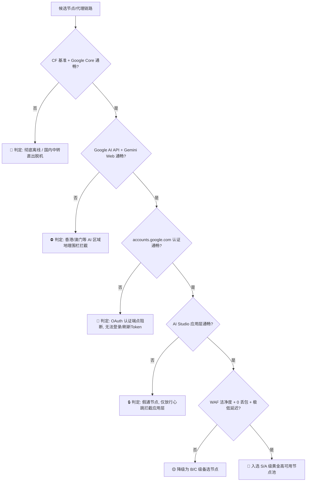

# 🛰️ Antigravity Node Benchmark (V5.0 Universal)

> **Zero-Risk, Multi-Platform Node Stability & Egress Diagnostic Benchmark for Google AI, Gemini & Google Antigravity IDE**  
> *专为 Google AI、Gemini 与 Antigravity 打造的高可用代理节点稳定性与真实出口全息诊断天梯榜*

[](https://www.python.org/)
[](LICENSE)
[]()
[]()

---

## 🌟 核心亮点 (Key Highlights)

- 🔒 **100% 匿名无感探测 (Zero Account / Zero Auth Required)**  
  不涉及任何 Google API Key、OAuth Token 或账号登录凭证。纯网络层探针，**0 账号封禁风险**。
- ⚡ **零第三方依赖 (Zero External Dependencies)**  
  纯 Python 标准库开发，开箱即用，无需 `pip install` 任何额外第三方库。
- 🌐 **全代理平台兼容 (Universal Multi-Platform Support)**  
  - **模式 A (Controller API 模式 - 零切节点并发测)**：原生支持 **Flclash、Clash Verge Rev、Clash Nyanpasu、Clash for Windows、Mihomo Core、ShellCrash**。
  - **模式 B (Direct Proxy 模式 - 单端口全息测)**：原生支持 **v2rayN、Sing-box、Surge、Loon、Shadowsocks** 等任意本地 HTTP/SOCKS5 代理端口。
- 🎯 **独家 8 维全息出口诊断矩阵 (Full-Spectrum Diagnostic Matrix)**  
  不仅测延迟，更能精准识别：
  1. 🚨 **假海外 / 国内中转直出**（落地机脱机，流量滞留国内入口）
  2. ⛔ **Google AI 区域封锁**（香港、澳门等出口被 AI 官方地理围栏拦截）
  3. 🔑 **OAuth 认证受阻**（`accounts.google.com` 阻断，导致 Token 自动刷新失败）
  4. 🔒 **AI 应用层假通**（仅放行极简 204 心跳，但阻断 `aistudio` / `gemini` 真实应用流量）
  5. 🛡️ **Google Cloud Armor / WAF 洁净度**（脏 IP / 频控预警）
  6. ⏱️ **SSE 首包 TTFB (Time to First Byte) 与长流式稳定性评分**
- 📦 **自动生成可用资产**：
  - 终端彩色实时天梯榜 (Real-time Console View)
  - 深度 Markdown 诊断评估报告 (`ANTIGRAVITY_NODE_REPORT.md`)
  - Clash / Mihomo 专属高可用策略组 YAML (`antigravity_policy_group.yaml`)
  - Sing-box Outbounds 路由配置 JSON (`singbox_outbounds.json`)

---

## 🚀 快速上手 (Quick Start)

### 环境要求
- Python 3.8 或更高版本（Windows / macOS / Linux 全平台支持）

### 运行方式

#### 1. Clash / Mihomo / Flclash / Clash Verge 客户端（推荐）
保持代理客户端运行，直接在终端执行：

```bash
# 自动探测活跃的控制端口 (9090 / 9097 / 2049)
python main.py
```

#### 2. v2rayN / Sing-box / Surge / 任意本地代理端口
如果你使用 v2rayN、Sing-box 或 Surge，指定本地代理端口即可运行单端口全息诊断：

```bash
# 测试本地 HTTP 代理端口
python main.py --proxy http://127.0.0.1:7890

# 测试本地 SOCKS5 代理端口
python main.py --proxy socks5://127.0.0.1:10808
```

---

## 📊 8 维诊断矩阵与分级逻辑 (Diagnostic Matrix)



### 天梯等级说明

| 等级 | 标识 | 核心特征 | 建议用途 |
| :--- | :---: | :--- | :--- |
| **S 级 (黄金节点)** | 🌟 | **0 丢包**、极低延迟 (TTFB < 250ms)、WAF 纯净 | **⭐ 强力首选主力** (最适合长代码流式输出) |
| **A 级 (优质主力)** | 🟢 | **0 丢包**、Google AI 全端点通畅、低抖动 | **日常开发稳定节点** |
| **B 级 (普通备选)** | 🟡 | 偶发微抖动或轻度高延迟 | 作为应急备选 |
| **C 级 (易断流)** | 🟠 | 丢包率 > 15% 或平均延迟 > 400ms | 建议避开 |
| **F 级 (受限/失效)**| ⛔ / 🚨 | 国内直出 / 香港受限 / OAuth阻断 / 假通 | **严禁使用** |

---

## ⚙️ CLI 命令行参数 (Command-line Options)

```text
用法: main.py [-h] [--api API] [--secret SECRET] [--proxy PROXY]
               [--concurrency CONCURRENCY] [--timeout TIMEOUT]
               [--filter FILTER] [--report REPORT] [--yaml YAML]
               [--sing-box SING_BOX]

选项:
  --api API             Clash/Mihomo 控制端口 URL (默认自动探测 9090/9097/2049)
  --secret SECRET       控制端口 Secret 鉴权密钥 (未设置可留空)
  --proxy PROXY         指定单代理端口直接测试 (如 http://127.0.0.1:7890)
  --concurrency, -c     并发探测线程数 (默认: 16)
  --timeout, -t         单节点超时时间 ms (默认: 3500)
  --filter, -f          按关键词过滤节点名称 (如 'Singapore', 'Japan', 'US')
  --report, -r          Markdown 报告保存路径 (默认: ANTIGRAVITY_NODE_REPORT.md)
  --yaml, -y            Clash 高可用策略组导出路径 (默认: antigravity_policy_group.yaml)
  --sing-box, -s        Sing-box 出站配置导出路径 (如: singbox_outbounds.json)
```

---

## 🛡️ Clash / Flclash 高可用策略组配置示例

运行完成后，脚本会自动生成 `antigravity_policy_group.yaml`。将其加入配置即可享受**智能自动优选 + 秒级故障无感容灾**：

```yaml
proxy-groups:
  # 1. 智能自动优选组 (每次对话自动选择延迟最低的 S/A 级节点)
  - name: 🚀 Antigravity-Auto
    type: url-test
    url: https://generativelanguage.googleapis.com/generate-204
    interval: 180
    tolerance: 40
    proxies:
      - "🇸🇬 Singapore-01"
      - "🇺🇸 UnitedStates-01"
      - "🇯🇵 Japan-01"

  # 2. 故障无感容灾组 (主节点异常时按顺序无缝切换到备选节点)
  - name: 🛡️ Antigravity-Fallback
    type: fallback
    url: https://generativelanguage.googleapis.com/generate-204
    interval: 120
    proxies:
      - "🇸🇬 Singapore-01"
      - "🇺🇸 UnitedStates-01"
      - "🇯🇵 Japan-01"

rules:
  - DOMAIN-SUFFIX,generativelanguage.googleapis.com,🚀 Antigravity-Auto
  - DOMAIN-SUFFIX,aistudio.google.com,🚀 Antigravity-Auto
  - DOMAIN-SUFFIX,gemini.google.com,🚀 Antigravity-Auto
  - DOMAIN-KEYWORD,generativeai,🚀 Antigravity-Auto
```

---

## 📄 License & Disclaimer

- **License**: 本项目基于 [MIT License](LICENSE) 开源。
- **Disclaimer**: 本工具仅用于网络可达性与服务连通性诊断，不收集任何用户隐私或账号数据，探测过程 100% 匿名无感。
